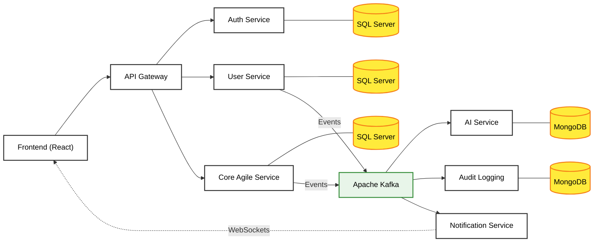

# Taskove - Event-Driven Microservices Architecture

This repository contains the architecture and high-level structure of the **Taskove** capstone project. 
The system is designed as an Event-Driven Microservices architecture using Spring Boot, Apache Kafka, and various database technologies.

## 🏗️ Architecture Diagram

Below is the simplified flow of the system. Note that the **Authentication** and **User** services have been separated to adhere to the Single Responsibility Principle.

## 🧩 Services Breakdown

### 1. Client Layer
- **Frontend**: The React, Tailwind, and GSAP user interface. It communicates exclusively with the API Gateway via REST and receives real-time updates via WebSockets.

### 2. Infrastructure & Routing
- **API Gateway**: Acts as the single entry point. Validates JWTs and routes requests to the appropriate microservice.
- **Service Registry (Eureka)**: (Implicit in the diagram) Used for service discovery so microservices can find each other dynamically.

### 3. Core Microservices (Synchronous)
- **Auth Service**: Solely responsible for Authentication (Login, Register, JWT Generation, validating credentials).
- **User Service**: Manages user profiles, roles (RBAC), and user-specific details. Separating this from Auth ensures that user profile management does not interfere with the critical login/security flows.
- **Core Agile Service**: The main domain service handling Workspaces, Projects, Sprints, Tasks, and Kanban boards.

### 4. Message Broker
- **Apache Kafka**: The central nervous system for asynchronous communication. Services publish events (e.g., "Task Created", "User Registered") here without waiting for a response.

### 5. Asynchronous / Specialized Services
- **AI & Capacity Service**: Consumes events to calculate team capacity and uses LLMs to generate automated standups or retrospectives.
- **Audit Logging Service**: Listens for system-wide events and logs user actions for security and tracking.
- **Notification Service**: Listens for specific events (like task assignments) and pushes real-time WebSocket notifications back to the Frontend.
